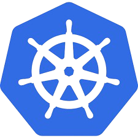

<h1 align="center" style="border-bottom: none">
    
</h1>

<center><h1>Kubernetes</h1></center>

<p align="center">Acesse o <a href="https://kubernetes.io/docs/home/" target="_blank">site oficial</a> 
para uma documentação completa, exemplos e guias.</p>

---

Este projeto simplifica a instalação do Kubernetes em servidores on-premise, ideal para ambientes de ```laboratório```, ```testes``` e ```experimentação```.

## Pré-requisitos

 * Providenciar dois servidores virtuais ou locais com as seguintes configurações:

|Sistema Operacional|CPU|Memória| Disco
|:--                |:--: |:--:|:--:  | 
|Ubuntu 24.04.1     |2   |3GB   |40GB 

* Certificar-se de que os dois servidores estão se comunicando na rede.

## Cluster Kubernetes

O cluster será formado por dois servidores: um atuará como **Master** e o outro como **Node**, com a capacidade de ambos executarem Pods. 

Para um entendimento aprofundado do processo de instalação, optei por não fornecer scripts. 

A ideia é que você execute e **compreenda** cada comando passo a passo.

## Procedimento de instalação

Este guia pressupõe que você já tem uma compreensão básica de Kubernetes e seus [componentes](https://kubernetes.io/docs/concepts/overview/components/), bem como experiência com o sistema operacional Linux. Isso garantirá que você possa acompanhar os passos com mais facilidade.  

### Configuração do arquivo /etc/hosts

**Servidores:** Master-Node e Worker-Node

```java
192.168.0.100 master-node.devopseasybr.local master-node
192.168.0.101 worker-node.devopseasybr.local worker-node
```

### Instalação do Docker

**Servidores:** Master-Node e Worker-Node

```bash
apt-get update
apt-get install ca-certificates curl
install -m 0755 -d /etc/apt/keyrings
curl -fsSL https://download.docker.com/linux/ubuntu/gpg -o /etc/apt/keyrings/docker.asc
chmod a+r /etc/apt/keyrings/docker.asc
echo "deb [arch=$(dpkg --print-architecture) signed-by=/etc/apt/keyrings/docker.asc] https://download.docker.com/linux/ubuntu \
            $(. /etc/os-release && echo "$VERSION_CODENAME") stable" | \
            tee /etc/apt/sources.list.d/docker.list > /dev/null

apt-get update
apt-get install docker-ce docker-ce-cli containerd.io docker-buildx-plugin docker-compose-plugin -y
```

### Instalaçao do Kubernetes

**Servidores:** Master-Node e Worker-Node

```bash
apt-get update
apt-get install -y apt-transport-https ca-certificates curl gpg
export KUBERNETES_VERSION=v1.32
curl -fsSL https://pkgs.k8s.io/core:/stable:/$KUBERNETES_VERSION/deb/Release.key | gpg --dearmor -o /etc/apt/keyrings/kubernetes-apt-keyring.gpg
echo "deb [signed-by=/etc/apt/keyrings/kubernetes-apt-keyring.gpg] https://pkgs.k8s.io/core:/stable:/$KUBERNETES_VERSION/deb/ /" | tee /etc/apt/sources.list.d/kubernetes.list
apt-get update
apt-get install -y kubelet kubeadm kubectl
apt-mark hold kubelet kubeadm kubectl
systemctl enable --now kubelet
kubeadm version

```

### Desabile o swap e comente a última linha do arquivo fstab

**Servidores:** Master-Node e Worker-Node

```bash
swapoff -a
```

Arquivo /etc/fstab:

````bash
#/swap.img	none	swap	sw	0	0
````

```bash
mount -a && free -h
```

### Configure o containerd do Docker

**Servidores:** Master-Node e Worker-Node

```bash
touch /etc/modules-load.d/containerd.conf
echo "overlay" >> /etc/modules-load.d/containerd.conf
echo "br_netfilter" >> /etc/modules-load.d/containerd.conf
modprobe overlay
modprobe br_netfilter
```

### Configure o kubernetes

**Servidores:** Master-Node e Worker-Node

```bash
touch /etc/sysctl.d/kubernetes.conf
echo "net.bridge.bridge-nf-call-ip6tables = 1" >> /etc/sysctl.d/kubernetes.conf
echo "net.bridge.bridge-nf-call-iptables = 1" >> /etc/sysctl.d/kubernetes.conf
echo "net.ipv4.ip_forward = 1" >> /etc/sysctl.d/kubernetes.conf
sysctl --system > /dev/null 2>&1
```

### Configure o kubelet

**Servidores:** Master-Node e Worker-Node

```bash
sed -i '/^KUBELET_EXTRA_ARGS=/ s/=\(.*\)/=\1--cgroup-driver=cgroupfs/' /etc/default/kubelet *******
```

### Configure o Docker daemon

**Servidores:** Master-Node e Worker-Node

```bash
vim /etc/docker/daemon.json
{
        "exec-opts": ["native.cgroupdriver=systemd"],
        "log-driver": "json-file",
        "log-opts": {
        "max-size": "100m"
    },
        "storage-driver": "overlay2"
}

systemctl daemon-reload && systemctl restart docker

```

### Configure o kubeadm

**Servidores:** Master-Node e Worker-Node

```bash
vim /usr/lib/systemd/system/kubelet.service.d/10-kubeadm.conf
Environment="KUBELET_EXTRA_ARGS=--fail-swap-on=false"

sudo systemctl daemon-reload && sudo systemctl restart kubelet
containerd config default | tee /etc/containerd/config.toml >/dev/null 2>&1
systemctl restart containerd && systemctl enable containerd
```

### Configure o kubeconfig

**Servidores:** Master-Node

```bash
vim /root/.bashrc
export KUBECONFIG=/etc/kubernetes/admin.conf
source ~/.bashrc
```

### Iniciar o cluster kubernetes

**Servidores:** Master-Node

```bash
kubeadm init --control-plane-endpoint=master.devopslabs.local --upload-certs | tee -a kubeadm.log
```

### Instalação do Calico

**Servidores:** Master-Node 

```bash
kubectl apply -f https://docs.projectcalico.org/manifests/calico.yaml
```

### Configuração do arquivo config

**Servidores:** Worker-Node

```bash
mkdir /root/.kube/
touch /root/.kube/config
```
Copie o conteúdo do arquivo ```/etc/kubernetes/admin.conf```, encontrado no servidor **master-node** e cole no arquivo _/root/.kube/config_.

Edite o arquivo ```/root/.bashrc``` e crie a variável de ambiente KUBECONFIG:

```bash
export KUBECONFIG=/root/.kube/config
```

### Crie o token para adicionar o worker-node

**Servidores:** Master-Node

```bash
kubeadm token create --print-join-command
```

### Adicione o servidor worker-node no cluster Kubernetes

**Servidores:** Worker-Node

```bash
kubeadm join master-node.devopseasybr.local:6443 \
        --token <TOKEN_GERADO PELO MASTER-NODE> \
        --discovery-token-ca-cert-hash sha256:<TOKEN-CA_GERADO PELO MASTER NODE>
```

## Pós-Instalação

Execute os comandos abaixo nos dois servidores.

```bash
kubectl get componentstatus
kubectl get nodes -owide
kubectl describe nodes
kubectl get namespaces
kubectl get pods -n kube-system
kubectl run test-dns --image=busybox:1.28 --rm -it --restart=Never -- nslookup kubernetes.default
```

## Testes

Os testes podem ser realizados em qualquer servidor.

### Crie um Deployment do Nginx

```bash
kubectl create deployment nginx-test --image=nginx
```

#### Exponha o Deployment como um Service (NodePort para acesso externo)

```bash
kubectl expose deployment nginx-test --type=NodePort --port=80
```

### Verifique se os POD's estão sendo executados

```bash
kubectl get pods -l app=nginx-test
```

### Verifique se o Service foi criado e a porta que está sendo utilizada:

```bash
kubectl get service nginx-test
```

### Acesse a página inicial do Nginx

```bash
curl http://<IP_DO_WORKER_NODE>:<PORTA_NODEPORT>
```

### Após o teste remova os objetos criados

```bash
kubectl delete service nginx-test
kubectl delete deployment nginx-test
```